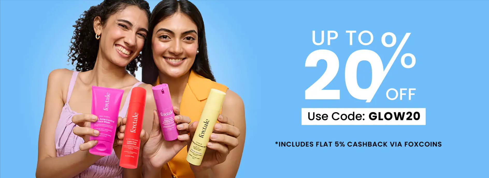

# 🌸 Foxtale Clone Website

A responsive front-end clone of the Foxtale skincare website built using **HTML5** and **CSS3**. This project recreates the modern UI of an e-commerce skincare website with product sections, banners, navigation, and a responsive layout.

## 🚀 Features

- Responsive Navigation Bar
- Hero Image Slider (CSS Animation)
- Skincare Products Section
- Bodycare Products Section
- Product Cards with Price & Add Button
- "See All" Product Page
- Promotional Banner
- Responsive Footer
- Mobile-Friendly Design
- Pure HTML & CSS (No JavaScript)

## 🛠️ Technologies Used

- HTML5
- CSS3
- Flexbox
- CSS Grid
- Media Queries
- CSS Animations

## 📂 Project Structure

```
Foxtale-Clone/
│
├── index.html
├── seeall2.html
├── style.css
├── images/
│   ├── foxtale_logo.png
│   ├── image1.png
│   ├── image2.png
│   ├── image3.png
│   ├── image4.png
│   └── ...
└── README.md
```

## 📱 Responsive Design

The website is optimized for:

- Desktop
- Mobile Devices

## 🎨 Sections Included

- Header & Navigation
- Hero Banner Slider
- Skincare Products
- Promotional Banner
- Bodycare Products
- See All Products Page
- Footer with Social Media Links

## 📸 Preview



> Replace the preview image with a screenshot of your project.

## 💡 Learning Outcomes

Through this project, I learned:

- Responsive web design
- Flexbox and CSS Grid
- CSS animations
- Product card layouts
- Website structure using HTML5
- Mobile-first styling with media queries

## 📌 Future Improvements

- Add JavaScript functionality
- Product Search
- Shopping Cart
- Dark Mode
- Product Filtering
- Login & Signup Pages

## 👩‍💻 Author

**Punam Rajhans**

- MCA Student
- Aspiring Front-End Developer

---

⭐ If you like this project, don't forget to give it a star on GitHub!